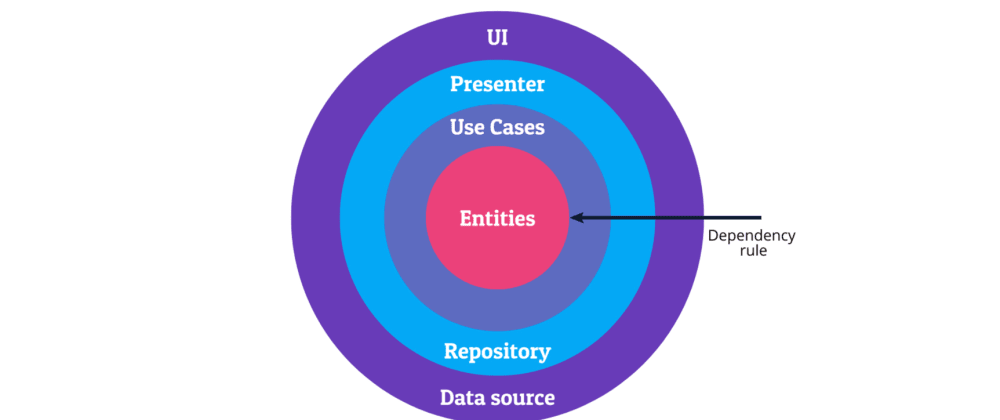

# CRUD Code Test

Please read each note very carefully!
Feel free to add/change project structure to a clean architecture to your view.
and if you are not able to work on FrontEnd project, you can add a Swagger UI
in a new Front project.

Create a simple CRUD application with that implements the below model:

```
Customer {
	Firstname
	Lastname
	DateOfBirth
	PhoneNumber
	Email
	BankAccountNumber
}
```

## Practices and patterns (Must)

- [TDD](https://en.wikipedia.org/wiki/Test-driven_development)
- [DDD](https://en.wikipedia.org/wiki/Domain-driven_design)
- [BDD](https://en.wikipedia.org/wiki/Behavior-driven_development): [Acceptance Test](https://en.wikipedia.org/wiki/Acceptance_testing)
- Clean git commits that shows your work progress.

## Clean Architecture (Must)



### Validations (Must)

- During Create; validate the phone number to be a valid *mobile* number only (You can use [Google LibPhoneNumber](https://github.com/google/libphonenumber) to validate number at the backend).

- A Valid email and a valid account number must be checked before submitting the form.

- Customers must be unique in database: By `Firstname`, `Lastname` and `DateOfBirth`.

- Email must be unique in the database.

### Storage (Must)

- Use database of choise to store data.

- Store the phone number in a database with minimized space storage (choose `varchar`/`string`, or `Uint64` whichever store less space).

### Submit your result

Please clone this repository in a new github repository in private mode and share with ID: `mason-chase` in private mode on github.com
